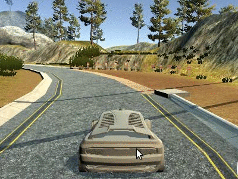
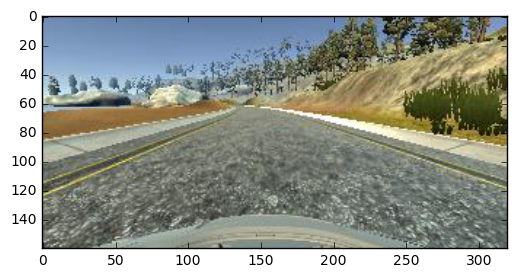
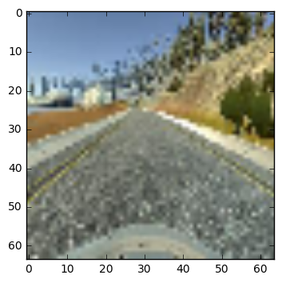
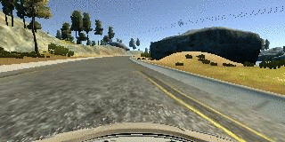
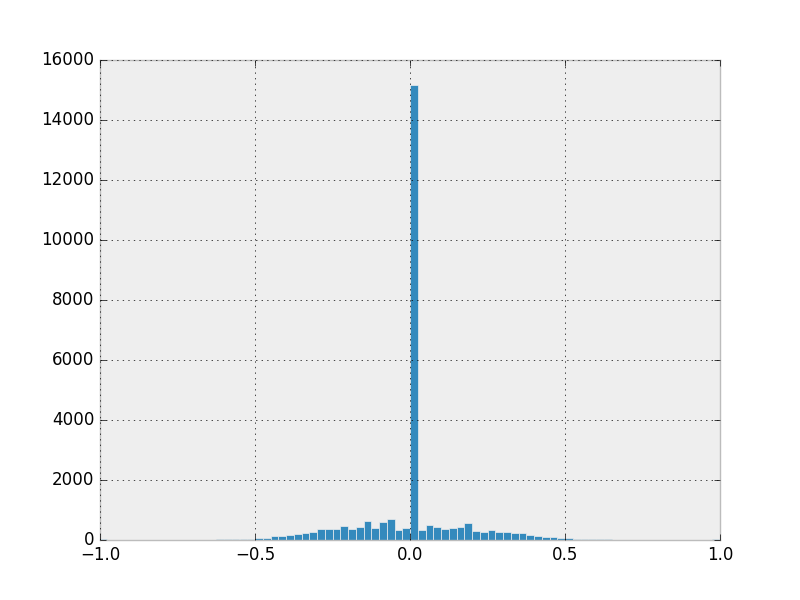
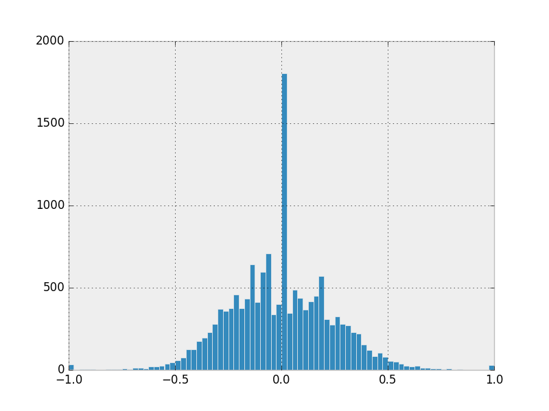

## Behavioral Cloning


### Introduction
A self driving agent given the front view of a car. This version only focus on predicting steering angle. The simulator is powered by Udacity and can be downloaded [HERE](https://d17h27t6h515a5.cloudfront.net/topher/2016/November/5831f0f7_simulator-linux/simulator-linux.zip).

### Requirement
[Python 3.x](https://www.python.org/)  
[Pandas](http://pandas.pydata.org/)  
[Numpy](http://www.numpy.org/)  
[Keras](https://keras.io/) on [TensorFlow](https://www.tensorflow.org/)

### The Problem
One of the most important actions in driving a car is to steer the car to the right direction. That allows the car to stay on track or avoid obstacles. Basically, human driver steers based on what they see in the front view and the most fundamental information is how the current track goes. This project will clone this kind of behavior using deep learning to enable a driving agent in a simulator steers automatically to stay on track. That is, given a front view image X, the model will return a steering angle for the agent to apply for navigation.

### Result
###### 1. Run my Model
Make sure you have TensorFlow and Keras installed,
Here is how the agent drives with `model.json` in the directory, turn on the simulator, select a track and click `AUTONOMOUS MODE`. Go ahead and open a terminal and type `$ python drive.py model.json`. You can also try the other model in json by replacing the filename, but `model.json` is my best shot so far. If you are interested, fork this and easily train your own!

###### 2. The Autonomous Driving
 Here are three capture of the autonomous driving. The first one is on track 1, the second is on track 2 and the last one shows how the agent recover from deviation(`model_vgg.json`)  
NOTE: None of my model is able to complete full track_2 so far and the vgg model drives like a drunk man.  
      

### Pipeline
###### 1. Getting the Data
The simulator provides a easy way to record the driving behavior of the user to local disk.
As you drive, the simulator generates two part of the data, the first part is captured frames of your driving record in three different views, left, center and right, while the other part is a csv file called "driving_log" which store the path of those images and the according driving actions, steering angle, speed, brake and throttle. This version of the project, focus on predicting the steering angle under the top speed the simulator allows.

###### 2. Loading the Data
The simulator provides two different tracks, Locally I kept the data in two different directory. I also use the Udacity's sample data for track 1 which contains the recovery actions. Therefore, In ```model.py``` I load three different part of data from my local directory using pandas ```read_csv()``` function.

###### 3. Preprocessing
The original data is in shape ```(320, 160, 3)``` on the left is an example of the image before resizing. To reduce memory usage I scaled down to ```(64, 64, 3)``` as shown on the right. The image is blurred but still recognizable.  
     
I also do a feature scaling on color RGB values to make the data zero mean and fall on an interval of [-0.5, 0.5] and split the data into training set and validation set in 9:1.

###### 4. Architecture
Keras on TensorFlow is applied in this project. I write three different type of model.

The first one is my own network. (by setting `mod = 'PNET'` in `model.py`)  
 I used this architecture to do SVHN classification and traffic sign classification, and I modified the kernel size by trying and add more dense layer to the end followed by a Dense 1 layer to do regression. Here's the model's structure. To avoid overfitting, a high dropout rate is used. :
```
          Layer (type)                     Output Shape         
          ======================================================
          input_1 (InputLayer)             (None, 64, 64, 3)    
          ______________________________________________________
          lambda_1 (Lambda)                (None, 64, 64, 3)    
          ______________________________________________________
          convolution2d_1 (Convolution2D)  (None, 64, 64, 16)   
          ______________________________________________________
          convolution2d_2 (Convolution2D)  (None, 32, 32, 64)   
          ______________________________________________________
          dropout_1 (Dropout)              (None, 32, 32, 64)   
          ______________________________________________________
          convolution2d_3 (Convolution2D)  (None, 16, 16, 128)  
          ______________________________________________________
          flatten_1 (Flatten)              (None, 32768)        
          ______________________________________________________
          dense_1 (Dense)                  (None, 512)          
          ______________________________________________________
          dropout_2 (Dropout)              (None, 512)              
          ______________________________________________________
          dense_2 (Dense)                  (None, 32)           
          ______________________________________________________
          dense_3 (Dense)                  (None, 1)            
          ======================================================
          Total params: 17027137
          ______________________________________________________


```


The second model is a network with VGG16 feature extraction and regression head. (by setting `mod = 'PNET'` in `model.py`)  
 The last couple of layers I added are:
```
          Layer (type)                     Output Shape         
          ======================================================
          input_1 (InputLayer)             (None, 64, 64, 3)    
          ______________________________________________________
                                    .
                                    .
                                    .
          ______________________________________________________
          flatten_1 (Flatten)              (None, 2048)         
          ______________________________________________________
          dense_1 (Dense)                  (None, 1024)         
          ______________________________________________________
          dense_2 (Dense)                  (None, 256)          
          ______________________________________________________
          dropout_1 (Dropout)              (None, 256)          
          ______________________________________________________
          dense_3 (Dense)                  (None, 32)           
          ______________________________________________________
          dense_4 (Dense)                  (None, 1)            
          ======================================================
          Total params: 2368833
          ______________________________________________________

```

The last model is from NVIDIA's [End to End Learning for Self-Driving Cars. ](https://images.nvidia.com/content/tegra/automotive/images/2016/solutions/pdf/end-to-end-dl-using-px.pdf)
But I currently stuck on gradient vanishing on this model.

###### 5. Training
* The loss is the mean squared error of the output and the steering actual steering angle.
* The optimizer is Adam.
* A batch_size of 128
* 10 epoch  

In convenient, I use [Adam](https://arxiv.org/pdf/1412.6980v8.pdf) optimizer. My experiments mainly focus on tuning the kernel size and the dropout probability. In my own model, which I called PNet in `model.py`, 0.8 dropout rate is applied to prevent overfitting.

To prevent GRAM from exploding by data. I use generator to train the model. The code is shown in `io_utils.py`. The class `gen_from_file` store a DataFrame of the csv log and read image when a batch is requested for training.   

### Data Quality
* Driving manner  
I used keyboard to drive, mainly on the middle of the road in full speed available (about 30mph) to generate my own data for both tracks. And I mixed the sample data comes with the course materials to teach the agent how to recover from deviation.  
You can pause recording while driving. So you can drive off the track while recording is off and record only how you recover.   
  

* Distribution  
A very natural phenomenon is, we will get a dataset whose majority is 0.0 steering angle. because track in real world are mostly straight connected by several bends. After I do a resampling to drop 90% of the 0.0 steering data, the data looks well in distribution. However in my case, the original gave better result.  
  


### Future Improvement
* The model is confused about shadow on road and perform poorly on track 2 when shadow is rendered. More behavioral data on the shaded part of the road is needed.  

* With throttle, brake and speed data, the car is able to learn more complex behaviors like slowing down in turning and steering differently as the speed varies.

* It is possible to do real time learning as we drive on the simulator
